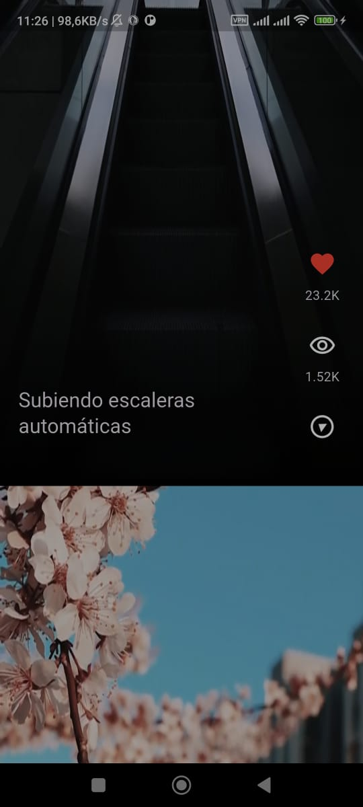
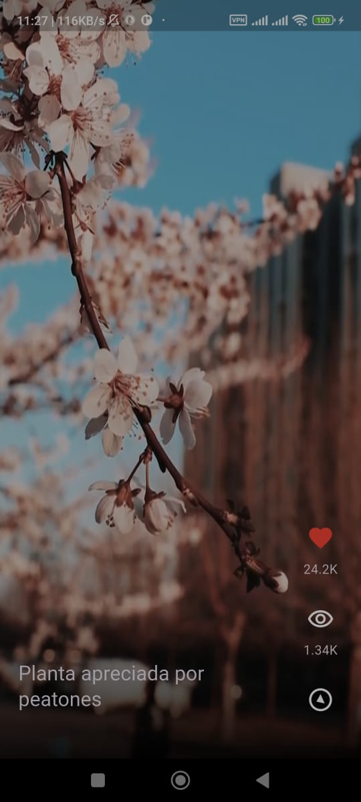
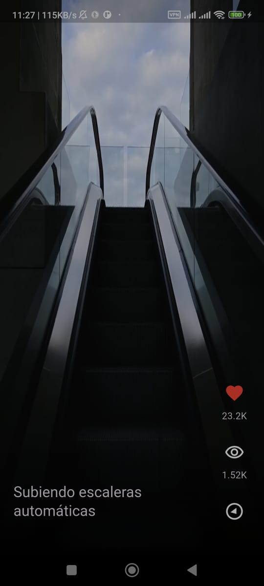

# to_kok: Plataforma de Videos Verticales (Demo)

**to_kok** es una aplicación móvil desarrollada con **Flutter**, creada como un proyecto de demostración para mostrar mis habilidades en el desarrollo de aplicaciones multiplataforma. Simula una **plataforma de videos verticales** inspirada en el formato popularizado por TikTok, YouTube Shorts e Instagram Reels.

---

## 🚀 Inicio Rápido

Estas instrucciones te permitirán ejecutar una copia del proyecto en tu entorno local para su evaluación.

### Prerrequisitos

Asegúrate de tener instalado:

* **Flutter SDK**: [Guía de instalación](https://docs.flutter.dev/get-started/install)
* **Editor de Código**: [VS Code](https://code.visualstudio.com/) (con la extensión de Flutter) o [Android Studio](https://developer.android.com/studio).

### Instalación y Ejecución

1.  Clona el repositorio:
    ```bash
    git clone [URL_DE_TU_REPOSITORIO_AQUÍ]
    ```
2.  Navega al directorio del proyecto:
    ```bash
    cd to_kok
    ```
3.  Obtén las dependencias de Flutter:
    ```bash
    flutter pub get
    ```
4.  Ejecuta la aplicación en un emulador o dispositivo conectado:
    ```bash
    flutter run
    ```

---

## 📸 Capturas de Pantalla

A continuación, puedes ver algunas capturas de la aplicación:
  
### Pantallas




## 🛠️ Tecnologías Utilizadas

* **Flutter**: Framework de Google para construir interfaces de usuario nativas en iOS, Android, web y escritorio desde una única base de código.

---

## 💡 Habilidades y Conceptos Demostrados

Este proyecto destaca mi experiencia y comprensión en los siguientes aspectos clave del desarrollo Flutter:

* **Gestión de Assets**: Inclusión y optimización de recursos multimedia, crucial para el manejo de videos.
* **Uso de Paquetes (Packages)**: Integración efectiva de librerías de terceros para extender la funcionalidad base de Flutter.
* **Gesture Detection**: Implementación de interacciones de usuario intuitivas (e.g., deslizamientos para cambiar de video, toques para pausar).
* **Posicionamiento y Layout de Widgets**: Construcción de interfaces responsivas y estéticamente agradables, utilizando widgets como `Stack` para superponer elementos sobre los videos.
* **Mappers**: Transformación y modelado de datos (por ejemplo, desde fuentes JSON a objetos Dart) para una gestión de datos limpia.
* **Gradientes**: Aplicación de efectos visuales para mejorar la estética de la UI.
* **Estructuras de Control**: Uso de bucles (`Loops`) y condicionales para la renderización dinámica de contenido.
* **Aserciones (Assertions)**: Prácticas de desarrollo para asegurar la robustez del código y la validación de condiciones.
* **Stacks**: Creación de diseños complejos mediante la superposición de widgets, ideal para controles de video o información de usuario.
* **Controladores de Video**: Implementación de la funcionalidad de reproducción, pausa y manejo del ciclo de vida de los videos verticales.

---